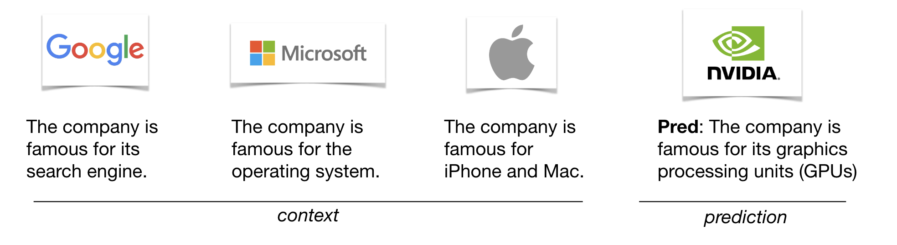
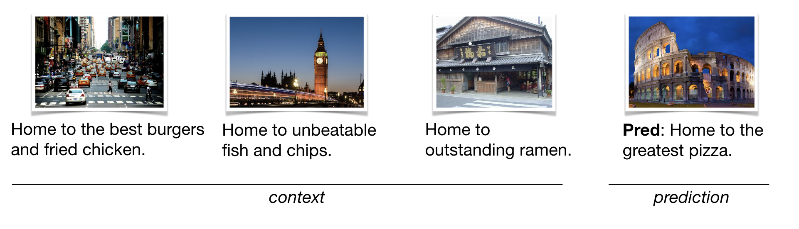
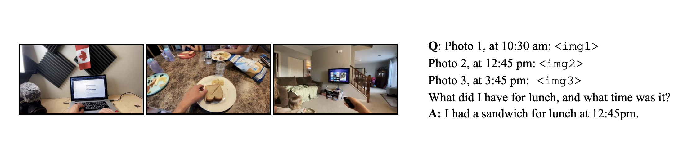

# VILA: Optimized Vision Language Models

[](CODE_LICENSE)
[](MODEL_LICENSE)
[](https://www.python.org/downloads/release/python-3100/)

[arXiv](https://arxiv.org/abs/2412.04468) / [Demo](https://vila.hanlab.ai/) / [Models](https://huggingface.co/collections/Efficient-Large-Model/nvila-674f8163543890b35a91b428) / [Subscribe](https://forms.gle/6nf1QdPYdvC2vgxM8)

## 💡 Introduction

VILA is a family of open VLMs designed to optimize both efficiency and accuracy for efficient video understanding and multi-image understanding. 

## 💡 News

- \[2025/1\] As of January 6, 2025 VILA is now part of the new Cosmos Nemotron vision language models.
- \[2024/12\] We release [NVILA](https://arxiv.org/abs/2412.04468) (a.k.a VILA2.0) that explores the full stack efficiency of multi-modal design, achieving cheaper training, faster deployment and better performance.
- \[2024/12\] We release [LongVILA](./longvila/README.md) that supports long video understanding, with long-context VLM with more than 1M context length and multi-modal sequence parallel system.
- \[2024/10\] VILA-M3, a SOTA medical VLM finetuned on VILA1.5 is released! VILA-M3 significantly outperforms Llava-Med and on par w/ Med-Gemini and is fully opensourced! [code](https://github.com/Project-MONAI/VLM#-news) [model](https://huggingface.co/MONAI)
- \[2024/10\] We release [VILA-U](https://github.com/mit-han-lab/vila-u): a Unified foundation model that integrates Video, Image, Language understanding and generation.
- \[2024/07\] VILA1.5 also ranks 1st place (OSS model) on [MLVU test leaderboard](https://github.com/JUNJIE99/MLVU).
- \[2024/06\] VILA1.5 is now the best open sourced VLM on [MMMU leaderboard](https://mmmu-benchmark.github.io/#leaderboard) and [Video-MME](https://video-mme.github.io/home_page.html#leaderboard) leaderboard!
- \[2024/05\] We release VILA-1.5, which offers **video understanding capability**. VILA-1.5 comes with four model sizes: 3B/8B/13B/40B.

<details>
<summary>Click to show more news</summary>

- \[2024/05\] We release [AWQ](https://arxiv.org/pdf/2306.00978.pdf)-quantized 4bit VILA-1.5 models. VILA-1.5 is efficiently deployable on diverse NVIDIA GPUs (A100, 4090, 4070 Laptop, Orin, Orin Nano) by [TinyChat](https://github.com/mit-han-lab/llm-awq/tree/main/tinychat) and [TensorRT-LLM](demo_trt_llm) backends.
- \[2024/03\] VILA has been accepted by CVPR 2024!
- \[2024/02\] We release [AWQ](https://arxiv.org/pdf/2306.00978.pdf)-quantized 4bit VILA models, deployable on Jetson Orin and laptops through [TinyChat](https://github.com/mit-han-lab/llm-awq/tree/main/tinychat) and [TinyChatEngine](https://github.com/mit-han-lab/TinyChatEngine).
- \[2024/02\] VILA is released. We propose interleaved image-text pretraining that enables **multi-image** VLM. VILA comes with impressive in-context learning capabilities. We open source everything: including training code, evaluation code, datasets, model ckpts.
- \[2023/12\] [Paper](https://arxiv.org/abs/2312.07533) is on Arxiv!

</details>

## Performance

## Image Benchmarks


### Video  Benchmarks


### Efficient Deployments


<sup>NOTE: Measured using the [TinyChat](https://github.com/mit-han-lab/llm-awq/tinychat) backend at batch size = 1.</sup>

### Inference Performance

#### Decoding Throughput ( Token/sec )

| $~~~~~~$                    |  A100  | 4090  | Orin |
| --------------------------- |  ----- | ----- | ---- |
| NVILA-3B-Baseline           |  140.6 | 190.5 | 42.7 |
| NVILA-3B-TinyChat           |  184.3 | 230.5 | 45.0 |
| NVILA-Lite-3B-Baseline      |  142.3 | 190.0 | 41.3 |
| NVILA-Lite-3B-TinyChat      |  186.0 | 233.9 | 44.9 |
| NVILA-8B-Baseline           |  82.1  | 61.9  | 11.6 |
| NVILA-8B-TinyChat           |  186.8 | 162.7 | 28.1 |
| NVILA-Lite-8B-Baseline      |  84.0  | 62.0  | 11.6 |
| NVILA-Lite-8B-TinyChat      |  181.8 | 167.5 | 32.8 |
| NVILA-Video-8B-Baseline *   |  73.2  | 58.4  | 10.9 |
| NVILA-Video-8B-TinyChat *   |  151.8 | 145.0 | 32.3 |

#### TTFT (Time-To-First-Token) ( Sec )

| $~~~~~~$                    |   A100  |  4090  |  Orin  |
| --------------------------- |  ------ | ------ | ------ |
| NVILA-3B-Baseline           |  0.0329 | 0.0269 | 0.1173 |
| NVILA-3B-TinyChat           |  0.0260 | 0.0188 | 0.1359 |
| NVILA-Lite-3B-Baseline      |  0.0318 | 0.0274 | 0.1195 |
| NVILA-Lite-3B-TinyChat      |  0.0314 | 0.0191 | 0.1241 |
| NVILA-8B-Baseline           |  0.0434 | 0.0573 | 0.4222 |
| NVILA-8B-TinyChat           |  0.0452 | 0.0356 | 0.2748 |
| NVILA-Lite-8B-Baseline      |  0.0446 | 0.0458 | 0.2507 |
| NVILA-Lite-8B-TinyChat      |  0.0391 | 0.0297 | 0.2097 |
| NVILA-Video-8B-Baseline *   |  0.7190 | 0.8840 | 5.8236 |
| NVILA-Video-8B-TinyChat *   |  0.6692 | 0.6815 | 5.8425 |

<sup>NOTE: Measured using the [TinyChat](https://github.com/mit-han-lab/llm-awq/tinychat) backend at batch size = 1, dynamic_s2 disabled, and num_video_frames = 64. We use W4A16 LLM and W8A8 Vision Tower for Tinychat and the baseline precision is FP16.</sup>
<sup>\*: Measured with video captioning task. Otherwise, measured with image captioning task.</sup>

## VILA Examples

### Video captioning

https://github.com/Efficient-Large-Model/VILA/assets/156256291/c9520943-2478-4f97-bc95-121d625018a6

Prompt: Elaborate on the visual and narrative elements of the video in detail.

Caption: The video shows a person's hands working on a white surface. They are folding a piece of fabric with a checkered pattern in shades of blue and white. The fabric is being folded into a smaller, more compact shape. The person's fingernails are painted red, and they are wearing a black and red garment. There are also a ruler and a pencil on the surface, suggesting that measurements and precision are involved in the process.

### In context learning




### Multi-image reasoning



### VILA on Jetson Orin

https://github.com/Efficient-Large-Model/VILA/assets/7783214/6079374c-0787-4bc4-b9c6-e1524b4c9dc4

### VILA on RTX 4090

https://github.com/Efficient-Large-Model/VILA/assets/7783214/80c47742-e873-4080-ad7d-d17c4700539f

## Installation

1.  Install [Anaconda Distribution](https://www.anaconda.com/download).
2.  Install the necessary Python packages in the environment.

    ```bash
    ./environment_setup.sh vila
    ```

3.  (Optional) If you are an NVIDIA employee with a wandb account, install
    onelogger and enable it by setting `training_args.use_one_logger` to `True`
    in `llava/train/args.py`.

    ```bash
    pip install --index-url=https://sc-hw-artf.nvidia.com/artifactory/api/pypi/hwinf-mlwfo-pypi/simple --upgrade one-logger-utils
    ```

4.  Activate a conda environment.

    ```bash
    conda activate vila
    ```

## Training

VILA training contains three steps, for specific hyperparameters, please check out the [scripts/NVILA-Lite](scripts/NVILA-Lite) folder:

### Step-1: Alignment

We utilize LLaVA-CC3M-Pretrain-595K dataset to align the textual and visual modalities.

The stage 1 script takes in two parameters and it can run on a single 8xA100 node.

```bash
bash scripts/NVILA-Lite/align.sh Efficient-Large-Model/Qwen2-VL-7B-Instruct <alias to data>
```

and the trained models will be saved to `runs/train/nvila-8b-align`.

### Step-1.5:

```bash
bash scripts/NVILA-Lite/stage15.sh runs/train/nvila-8b-align/model <alias to data>
```

and the trained models will be saved to `runs/train/nvila-8b-align-1.5`.

### Step-2: Pretraining

We use MMC4 and Coyo dataset to train VLM with interleaved image-text pairs.

```bash
bash scripts/NVILA-Lite/pretrain.sh runs/train/nvila-8b-align-1.5 <alias to data>
```

and the trained models will be saved to `runs/train/nvila-8b-pretraining`.

### Step-3: Supervised fine-tuning

This is the last stage of VILA training, in which we tune the model to follow multimodal instructions on a subset of M3IT, FLAN and ShareGPT4V. This stage runs on a 8xA100 node.

```bash
bash scripts/NVILA-Lite/sft.sh runs/train/nvila-8b-pretraining <alias to data>
```

and the trained models will be saved to `runs/train/nvila-8b-SFT`.

## Evaluations

We have introduce `vila-eval` command to simplify the evaluation. Once the data is prepared, the evaluation can be launched via

```bash
MODEL_NAME=NVILA-15B
MODEL_ID=Efficient-Large-Model/$MODEL_NAME
huggingface-cli download $MODEL_ID

vila-eval \
    --model-name $MODEL_NAME \
    --model-path $MODEL_ID \
    --conv-mode auto \
    --tags-include local
```

it will launch all evaluations and return a summarized result.

## Inference

We provide `vila-infer` for quick inference with user prompts and images.

```bash
# image description
vila-infer \
    --model-path Efficient-Large-Model/NVILA-15B \
    --conv-mode auto \
    --text "Please describe the image" \
    --media demo_images/demo_img.png

# video description
vila-infer \
    --model-path Efficient-Large-Model/NVILA-15B \
    --conv-mode auto \
    --text "Please describe the video" \
    --media https://huggingface.co/datasets/Efficient-Large-Model/VILA-inference-demos/resolve/main/OAI-sora-tokyo-walk.mp4
```

`vila-infer` is also compatible with VILA-1.5 models. For example:

```bash
vila-infer \
    --model-path Efficient-Large-Model/VILA1.5-3b \
    --conv-mode vicuna_v1 \
    --text "Please describe the image" \
    --media demo_images/demo_img.png

vila-infer \
    --model-path Efficient-Large-Model/VILA1.5-3b \
    --conv-mode vicuna_v1 \
    --text "Please describe the video" \
    --media https://huggingface.co/datasets/Efficient-Large-Model/VILA-inference-demos/resolve/main/OAI-sora-tokyo-walk.mp4


vila-infer \
    --model-path Efficient-Large-Model/NVILA-15B \
    --conv-mode auto \
    --text "Please describe the video" \
    --media https://huggingface.co/datasets/Efficient-Large-Model/VILA-inference-demos/resolve/main/OAI-sora-tokyo-walk.mp4
```

## Quantization and Deployment

Our VILA models are quantized by [AWQ](https://arxiv.org/abs/2306.00978) into 4 bits for efficient inference on the edge. We provide a push-the-button [script](https://github.com/mit-han-lab/llm-awq/blob/main/scripts/nvila_example.sh) to quantize VILA with AWQ, along with [pre-quantized weights](https://huggingface.co/Efficient-Large-Model/NVILA-AWQ) so you can try them out directly.

### Running VILA on desktop GPUs and edge GPUs

We support AWQ-quantized 4bit VILA on GPU platforms via [TinyChat](https://github.com/mit-han-lab/llm-awq/tree/main/tinychat). We provide a [tutorial](https://github.com/mit-han-lab/llm-awq/tree/main/tinychat#support-vlm-models-vila--llava) to run the model with TinyChat after quantization. We also provide an [instruction](https://github.com/mit-han-lab/llm-awq/tree/main/tinychat/serve) to launch a Gradio server (powered by TinyChat and AWQ) to serve 4-bit quantized VILA models.

### Running VILA on laptops

We further support our AWQ-quantized 4bit VILA models on various CPU platforms with both x86 and ARM architectures with our [TinyChatEngine](https://github.com/mit-han-lab/TinyChatEngine). We also provide a detailed [tutorial](https://github.com/mit-han-lab/TinyChatEngine/tree/main?tab=readme-ov-file#deploy-vision-language-model-vlm-chatbot-with-tinychatengine) to help the users deploy VILA on different CPUs.

### Running VILA API server

A simple API server has been provided to serve VILA models. The server is built on top of [FastAPI](https://fastapi.tiangolo.com/) and [Huggingface Transformers](https://huggingface.co/transformers/). The server can be run with the following command:

#### With CLI

```bash
python -W ignore server.py \
    --port 8000 \
    --model-path Efficient-Large-Model/NVILA-15B \
    --conv-mode auto
```

#### With Docker

```bash
docker build -t vila-server:latest .
docker run --gpus all --ipc=host --ulimit memlock=-1 --ulimit stack=67108864 \
    -v ./hub:/root/.cache/huggingface/hub \
    -it --rm -p 8000:8000 \
    -e VILA_MODEL_PATH=Efficient-Large-Model/NVILA-15B \
    -e VILA_CONV_MODE=auto \
    vila-server:latest
```

Then you can call the endpoint with the OpenAI SDK as follows:

```python
from openai import OpenAI

client = OpenAI(
    base_url="http://localhost:8000",
    api_key="fake-key",
)
response = client.chat.completions.create(
    messages=[
        {
            "role": "user",
            "content": [
                {"type": "text", "text": "What’s in this image?"},
                {
                    "type": "image_url",
                    "image_url": {
                        "url": "https://blog.logomyway.com/wp-content/uploads/2022/01/NVIDIA-logo.jpg",
                        # Or you can pass in a base64 encoded image
                        # "url": "data:image/png;base64,<base64_encoded_image>",
                    },
                },
            ],
        }
    ],
    model="NVILA-15B",
)
print(response.choices[0].message.content)
```

<sup>NOTE: This API server is intended for evaluation purposes only and has not been optimized for production use. SGLang support is coming on the way.</sup>

## Checkpoints

We release the following models:

- NVILA-8B / NVILA-8B-Lite
- NVILA-15B / NVILA-15B-Lite

## 🔒 License

- The code is released under the Apache 2.0 license as found in the [LICENSE](./LICENSE) file.
- The pretrained weights are released under the [CC-BY-NC-SA-4.0 license](https://creativecommons.org/licenses/by-nc-sa/4.0/deed.en).
- The service is a research preview intended for non-commercial use only, and is subject to the following licenses and terms:
  - [Model License](https://github.com/facebookresearch/llama/blob/main/MODEL_CARD.md) of LLaMA. For LLAMA3-VILA checkpoints terms of use, please refer to the [LLAMA3 License](https://llama.meta.com/llama3/license/) for additional details.
  - [Terms of Use](https://openai.com/policies/terms-of-use) of the data generated by OpenAI
  - [Dataset Licenses](./data_prepare/LICENSE) for each one used during training.

## Team

NVILA Core contributors: [Zhijian Liu](https://zhijianliu.com), [Ligeng Zhu](https://lzhu.me/), [Baifeng Shi](https://bfshi.github.io/), [Zhuoyang Zhang](https://openreview.net/profile?id=~Zhuoyang_Zhang1), [Yuming Lou](<>), [Shang Yang](https://ys-2020.github.io/), [Haocheng Xi](<>), [Shiyi Cao](<>), [Yuxian Gu](<>), [Dacheng Li](<>), [Xiuyu Li](<>), [Yunhao Fang](https://seerkfang.github.io/), [Yukang Chen](https://yukangchen.com/), [Cheng-Yu Hsieh](<>), [De-An Huang](<>), [An-Chieh Cheng](<>), [Vishwesh Nath](<>), [Jinyi Hu](<>), [Sifei Liu](<>), [Ranjay Krishna](<>), [Daguang Xu](<>), [Xiaolong Wang](<>), [Pavlo Molchanov](https://www.pmolchanov.com/), [Jan Kautz](https://jankautz.com/), [Hongxu Yin](https://hongxu-yin.github.io/), [Song Han](http://songhan.mit.edu/), [Yao Lu](https://scholar.google.com/citations?user=OI7zFmwAAAAJ&hl=en)

LongVILA contributors: [Yukang Chen](https://yukangchen.com/), [Fuzhao Xue](https://xuefuzhao.github.io/), [Dacheng Li](<https://dachengli1.github.io>), [Qinghao Hu](<https://tonyhao.xyz>), [Ligeng Zhu](https://lzhu.me/), [Xiuyu Li](<https://xiuyuli.com>), [Yunhao Fang](https://seerkfang.github.io/), [Haotian Tang](http://kentang.net/), [Shang Yang](https://ys-2020.github.io/), [Zhijian Liu](https://zhijianliu.com), [Ethan He](<>), [Hongxu Yin](https://hongxu-yin.github.io/), [Pavlo Molchanov](https://www.pmolchanov.com/), [Jan Kautz](<https://jankautz.com>), [Linxi Fan](<https://jimfan.me>), [Yuke Zhu](<https://yukezhu.me>), [Yao Lu](https://scholar.google.com/citations?user=OI7zFmwAAAAJ&hl=en), [Song Han](http://songhan.mit.edu/)

<details>
<summary> VILA-1.5 contributors </summary>

[\*Yao Lu](https://scholar.google.com/citations?user=OI7zFmwAAAAJ&hl=en): Nvidia, [\*Hongxu Yin](https://hongxu-yin.github.io/): Nvidia, [\*Ji Lin](https://www.linji.me/): OpenAI (work done at Nvidia and MIT), [Wei Ping](https://scholar.google.com/citations?user=6gKEYRgAAAAJ&hl=en): Nvidia, [Pavlo Molchanov](https://www.pmolchanov.com/): Nvidia, [Andrew Tao](https://scholar.google.com/citations?user=Wel9l1wAAAAJ&hl=en): Nvidia, [Haotian Tang](http://kentang.net/): MIT, [Shang Yang](https://ys-2020.github.io/): MIT, [Ligeng Zhu](https://lzhu.me/): Nvidia, MIT, [Wei-Chen Wang](https://weichenwang.me/): MIT, [Fuzhao Xue](https://xuefuzhao.github.io/): Nvidia, NUS, [Yunhao Fang](https://seerkfang.github.io/): Nvidia, UCSD, [Yukang Chen](https://yukangchen.com/): Nvidia, [Zhuoyang Zhang](https://openreview.net/profile?id=~Zhuoyang_Zhang1): Nvidia, [Yue Shen](https://www.linkedin.com/in/yue-james-shen/): Nvidia, [Wei-Ming Chen](https://scholar.google.com/citations?user=6xFvyJwAAAAJ&hl=en): Nvidia, [Huizi Mao](https://scholar.google.com/citations?user=r5WezOYAAAAJ&hl=zh-CN): Nvidia, [Baifeng Shi](https://bfshi.github.io/): Nvidia, UC Berkeley, [Jan Kautz](https://jankautz.com/): Nvidia, [Mohammad Shoeybi](https://scholar.google.com/citations?user=62ElavIAAAAJ&hl=en): Nvidia, [Song Han](http://songhan.mit.edu/): Nvidia, MIT

</details>

## Citations

```
@misc{liu2024nvila,
      title={NVILA: Efficient Frontier Visual Language Models},
      author={Zhijian Liu and Ligeng Zhu and Baifeng Shi and Zhuoyang Zhang and Yuming Lou and Shang Yang and Haocheng Xi and Shiyi Cao and Yuxian Gu and Dacheng Li and Xiuyu Li and Yunhao Fang and Yukang Chen and Cheng-Yu Hsieh and De-An Huang and An-Chieh Cheng and Vishwesh Nath and Jinyi Hu and Sifei Liu and Ranjay Krishna and Daguang Xu and Xiaolong Wang and Pavlo Molchanov and Jan Kautz and Hongxu Yin and Song Han and Yao Lu},
      year={2024},
      eprint={2412.04468},
      archivePrefix={arXiv},
      primaryClass={cs.CV},
      url={https://arxiv.org/abs/2412.04468},
}
```

```
@misc{chen2024longvila,
      title={LongVILA: Scaling Long-Context Visual Language Models for Long Videos},
      author={Yukang Chen and Fuzhao Xue and Dacheng Li and Qinghao Hu and Ligeng Zhu and Xiuyu Li and Yunhao Fang and Haotian Tang and Shang Yang and Zhijian Liu and Ethan He and Hongxu Yin and Pavlo Molchanov and Jan Kautz and Linxi Fan and Yuke Zhu and Yao Lu and Song Han},
      year={2024},
      eprint={2408.10188},
      archivePrefix={arXiv},
      primaryClass={cs.CV}
}
```

```
@misc{lin2023vila,
      title={VILA: On Pre-training for Visual Language Models},
      author={Ji Lin and Hongxu Yin and Wei Ping and Yao Lu and Pavlo Molchanov and Andrew Tao and Huizi Mao and Jan Kautz and Mohammad Shoeybi and Song Han},
      year={2023},
      eprint={2312.07533},
      archivePrefix={arXiv},
      primaryClass={cs.CV}
}
```

# Acknowledgement

- [LLaVA](https://github.com/haotian-liu/LLaVA): the codebase we built upon. Thanks for their wonderful work.
- [InternVL](https://github.com/OpenGVLab/InternVL): for open-sourcing InternViT (used in VILA1.5-40b) and the [InternVL-SFT](https://github.com/OpenGVLab/InternVL/tree/main/internvl_chat#prepare-training-datasets) data blend (inspired by LLaVA-1.6) used in all VILA1.5 models.
- [Vicuna](https://github.com/lm-sys/FastChat): the amazing open-sourced large language model!
- [Video-ChatGPT](https://github.com/mbzuai-oryx/Video-ChatGPT): we borrowed video evaluation script from this repository.
- [MMC4](https://github.com/allenai/mmc4), [COYO-700M](https://github.com/kakaobrain/coyo-dataset), [M3IT](https://huggingface.co/datasets/MMInstruction/M3IT), [OpenORCA/FLAN](https://huggingface.co/datasets/Open-Orca/FLAN), [ShareGPT4V](https://github.com/InternLM/InternLM-XComposer/tree/main/projects/ShareGPT4V), [WIT](google-research-datasets/wit), [GSM8K-ScRel](https://github.com/OFA-Sys/gsm8k-ScRel/blob/main/data/train_use.jsonl), [VisualGenome](https://visualgenome.org/api/v0/api_home.html), [VCR](https://visualcommonsense.com/download/), [ScienceQA](https://huggingface.co/datasets/derek-thomas/ScienceQA), [Shot2Story](https://github.com/bytedance/Shot2Story/blob/master/DATA.md), [Youcook2](http://youcook2.eecs.umich.edu/), [Vatex](https://eric-xw.github.io/vatex-website/download.html), [ShareGPT-Video](https://huggingface.co/datasets/ShareGPTVideo/train_video_and_instruction) for providing datasets used in this research.
