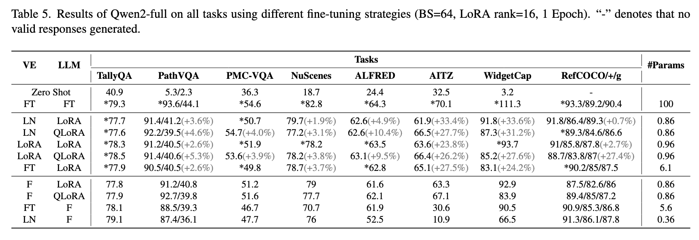

# VILA Fine-Tuning Instructions

# Data Preparation

## Single Image Dataset

VILA provides an out-of-the-box fine-tuning solution. Before running these scripts, you only need to prepare your data. Let's look at an example of adding a single-image QA dataset. The dataset should be organized in the following structure

```bash
/dataset/vila-dataset/sample-qa:
.
├── dataset.json
└── images
    ├── 1.jpg
    ├── 2.jpg
    └── ......
```

where the `dataset.json` is formatted to

```json
[
    {
        "image": "images/1.jpg",
        "conversations": [
            {
                "from": "human",
                "value": "What can you see in the image"
            },
            {
                "from": "gpt",
                "value": "In the center of the image, I can see..."
            }
        ]
    },
    {
        "image": "images/2.jpg",
        "conversations": [
            {
                "from": "human",
                "value": "How many chairs are there in the image"
            },
            {
                "from": "gpt",
                "value": "There are tottally 3 chairs..."
            }
        ]
    },
    # more data
]
```

Note that the `image` field should contain the **relative path** to the image under its root folder. The `conversations` field is a list that includes single or multi-round conversations. If you do not append the `<image>` tag specifically, VILA will automatically append one at the beginning.

Once you have the JSON file, you can add this dataset to `llava/data/registry/datasets/default.yaml` by adding an entry as follows:

```yaml
<dataset_name>:
    _target_: llava.data.LLaVADataset
    data_path: <path_to_json_file>
    media_dir: <image_root_folder_path>
```

For above QA dataset example, the entry information will be look like

```yaml
SampleQA:
    _target_: llava.data.LLaVADataset
    data_path: /dataset/vila-dataset/sample-qa/dataset.json
    media_dir: /dataset/vila-dataset/sample-qa
```

## Video Dataset

For video dataset, the file structure is similar

```bash
/dataset/vila-dataset/sample-qa:
.
├── dataset.json
└── videos
    ├── 1.mp4
    ├── 2.mp4
    └── ......
```

and the `dataset.json` will be look like

```json
[
    {
        "video": "videos/1.mp4",
        "conversations": [
            {
                "from": "human",
                "value": "Explain the video's components, including its characters, setting, and plot."
            },
            {
                "from": "gpt",
                "value": "The video sequence commences with a white screen that transitions"
            }
        ]
    }
    # more video data
]

```

```yaml
SampleVideo:
    _target_: llava.data.LLaVADataset
    data_path: /dataset/vila-dataset/sample-video/dataset.json
    media_dir: /dataset/vila-dataset/sample-video
    is_video: true
```

## Launch Training

Now you are ready to go! Simple run the training script with the dataset you would like to train on indicated in the script. Dataset names are concatenated with `+`. For example, if you train on three datasets, then the script looks like this:

```bash
# reduce the global bs or increase the accum steps if facing OOM issues
DEFAULT_RUN_NAME="NVILA-Lite-8B-finetune-trial" \
DEFAULT_GLOBAL_TRAIN_BATCH_SIZE=64 \
DEFAULT_GRADIENT_ACCUMULATION_STEPS=2 \
    bash scripts/NVILA-Lite/sft.sh \
        Efficient-Large-Model/NVILA-Lite-8B \
        SampleQA
```

if you have multiple datasets to finetune, you can concatenate them with `+` such as

```bash
DEFAULT_RUN_NAME="NVILA-Lite-8B-finetune-trial" \
DEFAULT_GLOBAL_TRAIN_BATCH_SIZE=64 \
DEFAULT_GRADIENT_ACCUMULATION_STEPS=2 \
    bash scripts/NVILA-Lite/sft.sh \
        Efficient-Large-Model/NVILA-Lite-8B \
        SampleQA+SampleVideo+SampleOCR
```

Now you can see the loss curve and the checkpoints will be saved at `runs/train/NVILA-Lite-8B-finetune-trial`.

##

<details>
<summary>
## LoRA finetuning Guides
</summary>

This part is still under construction. Feel free to contact [Ligeng Zhu](ligengz@nvidia.com) if you have any questions.

## Options

We provide many different options for fine-tuning the model (in all cases the `mm_projector` is full fine-tuned):
| VE | LLM | Scripts |
|---------|------|---------------------------------|
|FT |FT |srun_fft_grouped |
| |Fine-tune Both Modules| |
|LoRA |LoRA |srun_lora_vt_llm_grouped |
|LoRA |QLoRA |srun_lora_vt_llm_grouped_nf4 |
|LN |LoRA |srun_ln_vt_lora_llm_grouped |
|LN |QLoRA |srun_ln_vt_lora_llm_grouped_nf4 |
|FT |LoRA |srun_fft_vt_lora_llm_grouped |
| |Fine-tune Single Modules| |
|F |LoRA |srun_lora_llm |
|F |QLoRA |srun_lora_llm_nf4 |
|FT |F |srun_fft_vt |
|LN |F |srun_ln_vt |

Examples for using these scripts can be found in `${VILA_HOME}/finetuning/finetune_all_ft.sh`

## Main findings

When fine-tuning the vision encoder (ViT) and language model (LLM) together using PEFT methods, we observe that the learning rate should be set differently for VE and LLM: the learning rate for the ViT part will be 5-50x smaller than that for the LLM part.
On the other hand, we also observe that fine-tuning the vision encoder with Layernorm can achieve comparable performance as LoRA while being more computational-efficient: it can reduce the training time by 25% compared to applying LoRA for the vision encoder. With the curated configuration setup, NVILA can be quickly finetuned to various downstream tasks under 24 GB memory with on-par performance.

## Results on various downstream tasks



<details>

That's it. Enjoy VILA!
