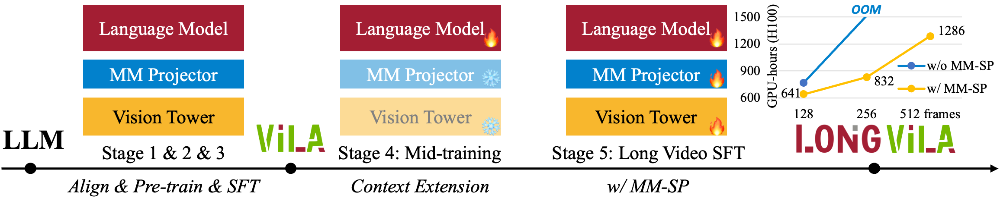
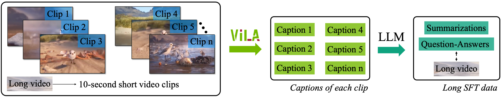
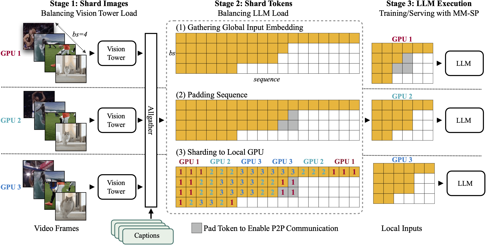
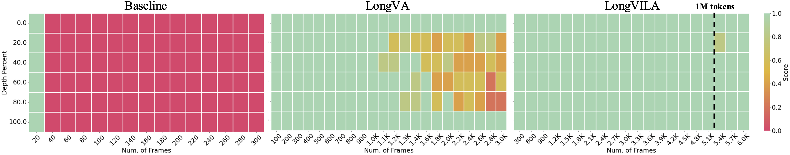
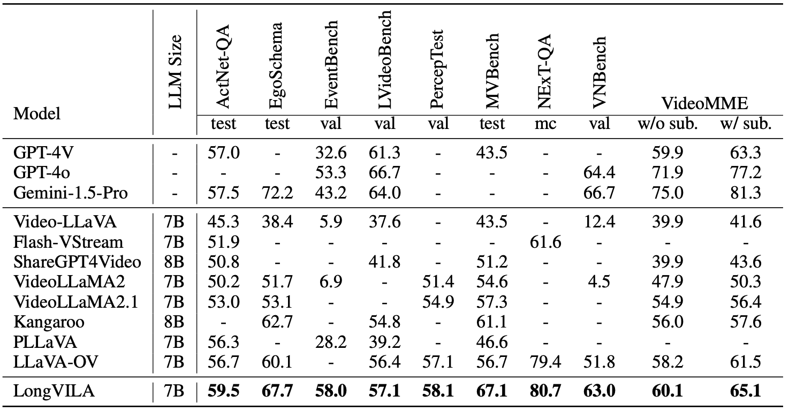

<p align="center">
  
</p>

# LongVILA: Scaling Long-Context Visual Language Models for Long Videos

[](CODE_LICENSE)
[](MODEL_LICENSE)
[](https://www.python.org/downloads/release/python-3100/)

[](https://arxiv.org/abs/2408.10188)
[](https://huggingface.co/collections/Efficient-Large-Model/longvila-66c3fce79284c8209f119b32)

## 💡 Introduction

Long-context capability is critical for multi-modal foundation models, especially for long video understanding. We introduce LongVILA, a full-stack solution for long-context visual-language models by co-designing the algorithm and system. For model training, we upgrade existing VLMs to support long video understanding by incorporating two additional stages, i.e., long context extension and long video supervised fine-tuning. However, training on long video is computationally and memory intensive. We introduce the long-context Multi-Modal Sequence Parallelism (MM-SP) system that efficiently parallelizes long video training and inference, enabling 2M context length training on 256 GPUs without any gradient checkpointing. LongVILA efficiently extends the number of video frames of VILA from 8 to 2048, achieving 99.8% accuracy in 6,000-frame (more than 1 million tokens) video needle-in-a-haystack. LongVILA-7B demonstrates strong accuracy on 9 popular video benchmarks, e.g., 65.1% VideoMME with subtitle. Besides, MM-SP is 2.1x - 5.7x faster than ring style sequence parallelism and 1.1x - 1.4x faster than Megatron with a hybrid context and tensor parallelism. Moreover, it seamlessly integrates with Hugging Face Transformers.

<p align="center">
  
Training Pipeline
</p>

<p align="center">
  
Long video SFT Dataset
</p>
<p align="center">
  
Multi-Modal Sequence Parallelism System
</p>

<p align="center">
  
6000-frame Needle in the Haystack (More than 1M context)
</p>
<p align="center">
  
Results on 9 benchmarks
</p>

## Installation

```bash
./environment_setup.sh vila
```

## Models

| Model              | LLM Size | Context | Training frames | Link                                                       |
|:-------------------|----------|---------|--------------------|------------------------------------------------------------|
| LongVILA-1.5B-256f | 1.5B     | 65536   | 256                | [qwen2-1.5b-longvila-256f](https://huggingface.co/Efficient-Large-Model/qwen2-1.5b-longvila-256f)      |
| LongVILA-7B-256f   | 7B       | 131072   | 256                | [qwen2-7b-longvila-256f](https://huggingface.co/Efficient-Large-Model/qwen2-7b-longvila-256f)     |
| LongVILA-7B-1M     | 7B       | 1048576      | 2048               | [qwen2-7b-longvila-1M](https://huggingface.co/Efficient-Large-Model/qwen2-7b-longvila-1M) |

## Datasets

| Dataset Usage                | Link                                                                                                                                                                                                                                                                                                              | Comments                                                                      |
|:------------------------|-------------------------------------------------------------------------------------------------------------------------------------------------------------------------------------------------------------------------------------------------------------------------------------------------------------------|-------------------------------------------------------------------------------|
| Stage4-LLM Context Extension | [64k](https://huggingface.co/datasets/LongVILA/slimpajama_encode_qwen2_64k) [256k](https://huggingface.co/datasets/LongVILA/slimpajama_encode_qwen2_256k) [512k](https://huggingface.co/datasets/LongVILA/slimpajama_encode_qwen2_512k) [1M](https://huggingface.co/datasets/LongVILA/slimpajama_encode_qwen2_1M) | Encode SlimPajama via Qwen2 tokenizer                                         |
| Stage5-LongVideo SFT        | [Data](https://huggingface.co/datasets/LongVILA/longvila_sft_dataset)                                                                                                                                                                                                                                             | Source long videos from [Shot2Story](https://github.com/bytedance/Shot2Story) |

## Training

We conduct continued training (Stage4 and Stage5) based on an VILA model as following.

### Stage4: LLM Context Extension

This is the first stage of LongVILA training, in which we tune the LLM in the VILA model to long context using SlimPajama dataset. For 7B model, this stage runs on a 8xA100 node for 64k context extension and at leat two 8xA100 node for 256k context extension.

```bash
bash longvila/train/4_extend_llm_64k.sh [STAGE3_PATH] [OUTPUT_NAME] [DATA_FILE]
```

The script takes in three arguments. `STAGE3_PATH` points to the trained VILA model. `OUTPUT_NAME` is the desired folder name under `checkpoints` that stores the final checkpoint. `DATA_FILE` is the data that store 64k-context Slimpajama data.

```bash
bash longvila/train/4_extend_llm_256k.sh [EXTENDED_64k_PATH] [OUTPUT_NAME] [DATA_FILE]
```

The script is a progressive training from 64k context to 256 context. `EXTENDED_64k_PATH` points to the `OUTPUT_NAME` of `4_extend_llm_64k.sh`. `DATA_FILE` is the data that store 256k-context Slimpajama data. If you do not need to train models longer than 256 frames (e.g., 512 or 1024 frames), you do not need to train this 256k context step.

Similar steps for 512k and 1M training scripts.

### Stage5: Long Supervised fine-tuning

This is the last stage of LongVILA training, in which we tune the model to follow long videos instructions. This stage runs on 32 8xH100 nodes for all different configurations (i.e. 256 frames, and 512 frames).

```bash
bash longvila/train/5_long_sft_256frames.sh [EXTENDED_64k_PATH]
[OUTPUT_NAME]
```

```bash
bash longvila/train/5_long_sft_512frames.sh [EXTENDED_256k_PATH]
[OUTPUT_NAME]
```

The scripts takes in two arguments. `EXTENDED_64k_PATH` and `EXTENDED_256k_PATH` points to the `OUTPUT_NAME` of the stage 4 script. `OUTPUT_NAME` is the desired folder name under `checkpoints` that stores the final checkpoint.

Similar steps for 1024-frame and 2048-frame training scripts.

> \[!Note\]
> 💡**Sequence Parallelism Configuration**
>
> To enable sequence parallelism, you can set the following parameters in the training script:
>
> `seq_parallel_size`:The degree of sequence parallelism (SP). SP is disabled by default (value: -1).
>
> `seq_parallel_ring_size`: The communication process group size using optimized Ring Attention approach in SP. Ring Attention approach is disabled by default in SP.
>
> `seq_parallel_ring_type`: Ring Attention implementation. Support \['ring_varlen', 'zigzag_ring_varlen'\] in 2D attention. Only works when *seq_parallel_ring_size* > 1.
>
> Please note that when SP is enabled, we treat each group of seq_parallel_size GPUs as a single device, with the global batch size calculated as the product of the per-device batch size and the data parallelism size.

## Evaluations

### Needle in the Haystack Experiments

`bash scripts/eval/needle.sh LongVILA-7B-1M Efficient-Large-Model/qwen2-7b-longvila-1M $VIDEO_PATH 6000 300`

### Benchmarks

`vila-eval -m Efficient-Large-Model/LongVILA-7B-256f -c auto -nf $NUM_VIDEO_FRAMES -t $TASKS `

`TASKS` can be from `{lmms-videomme-256,lmms-videomme_w_subtitle-256,vnbench_val,lmms-activitynetqa,egoschema_test,egoschema_val,eventbench_val,lmms-longvideobench_val_v,lmms-perceptiontest_val_mc,lmms-mvbench,lmms-nextqa_mc_test}`. We set `NUM_VIDEO_FRAMES` as 256 for videomme, 128 for vnbench and 32 for others.

## 🔒 License

- The code is released under the Apache 2.0 license as found in the [LICENSE](../LICENSE) file.
- The pretrained weights are released under the [CC-BY-NC-SA-4.0 license](https://creativecommons.org/licenses/by-nc-sa/4.0/deed.en).
- The service is a research preview intended for non-commercial use only, and is subject to the following licenses and terms:
  - [Model License](https://github.com/facebookresearch/llama/blob/main/MODEL_CARD.md) of Qwen2. For Qwen2-LongVILA checkpoints terms of use, please refer to the [Qwen2 License](https://huggingface.co/Qwen) for additional details.
  - [Terms of Use](https://openai.com/policies/terms-of-use) of the data generated by OpenAI
  - [Dataset Licenses](../data_prepare/LICENSE) for each one used during training.

## Citations

```
@article{longvila,
      title={LongVILA: Scaling Long-Context Visual Language Models for Long Videos},
      author={Yukang Chen and Fuzhao Xue and Dacheng Li and Qinghao Hu and Ligeng Zhu and Xiuyu Li and Yunhao Fang and Haotian Tang and Shang Yang and Zhijian Liu and Yihui He and Hongxu Yin and Pavlo Molchanov and Jan Kautz and Linxi Fan and Yuke Zhu and Yao Lu and Song Han},
      year={2024},
      eprint={2408.10188},
      archivePrefix={arXiv},
      primaryClass={cs.CV}
}
```

# Acknowledgement

- [LLaVA](https://github.com/haotian-liu/LLaVA): the codebase we built upon. Thanks for their wonderful work.
- [LongVA](https://github.com/EvolvingLMMs-Lab/LongVA): we borrowed the long video needle in the haystack evaluation script from this repository.
- [LongLoRA](https://github.com/dvlab-research/LongLoRA): we modified the low-rank long-context fine-tuning code from this repository.
- [USP (YunChang)](https://github.com/feifeibear/long-context-attention): we adopted the 2D attention implementation from this repository.
- [DeepSpeed Ulysses](https://github.com/microsoft/DeepSpeed): we adopted the all-to-all implementation from this repository.
- [RingFlashAttention](https://github.com/zhuzilin/ring-flash-attention): we adopted the ring flash attention implementation from this repository.
- [Video-ChatGPT](https://github.com/mbzuai-oryx/Video-ChatGPT): we borrowed video evaluation script from this repository.
- [MMC4](https://github.com/allenai/mmc4), [COYO-700M](https://github.com/kakaobrain/coyo-dataset), [M3IT](https://huggingface.co/datasets/MMInstruction/M3IT), [OpenORCA/FLAN](https://huggingface.co/datasets/Open-Orca/FLAN), [ShareGPT4V](https://github.com/InternLM/InternLM-XComposer/tree/main/projects/ShareGPT4V), [WIT](google-research-datasets/wit), [GSM8K-ScRel](https://github.com/OFA-Sys/gsm8k-ScRel/blob/main/data/train_use.jsonl), [VisualGenome](https://visualgenome.org/api/v0/api_home.html), [VCR](https://visualcommonsense.com/download/), [ScienceQA](https://huggingface.co/datasets/derek-thomas/ScienceQA), [Shot2Story](https://github.com/bytedance/Shot2Story/blob/master/DATA.md), [Youcook2](http://youcook2.eecs.umich.edu/), [Vatex](https://eric-xw.github.io/vatex-website/download.html), [ShareGPT-Video](https://huggingface.co/datasets/ShareGPTVideo/train_video_and_instruction), [ShareGPT4o](https://sharegpt4o.github.io/) for providing datasets used in this research.
