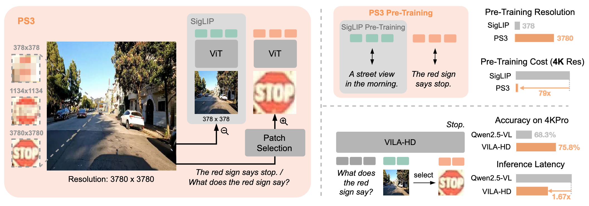
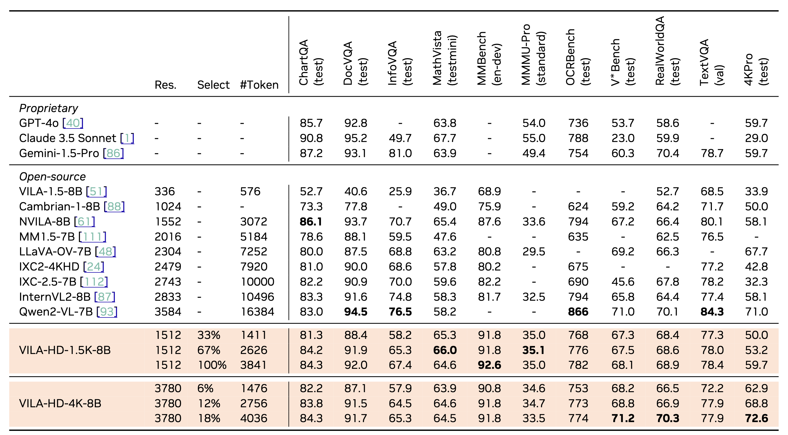
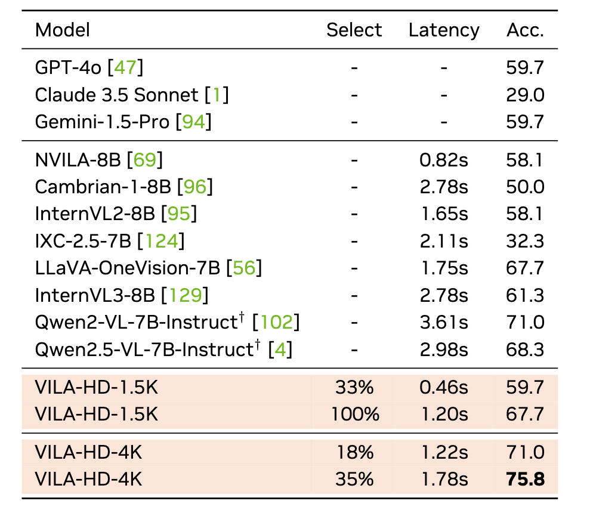

<div align="center">

# Scaling Vision Pre-Training to 4K Resolution

[](https://nvlabs.github.io/PS3/)
[](https://arxiv.org/abs/2503.19903)
[](https://huggingface.co/spaces/bfshi/VILA-HD-demo)
[](https://huggingface.co/collections/nvidia/ps3-scaling-vision-pre-training-to-4k-resolution-682d0535b61c07afd45242e9)
[](https://huggingface.co/collections/nvidia/ps3-scaling-vision-pre-training-to-4k-resolution-682d0535b61c07afd45242e9)
[](https://github.com/NVlabs/PS3)

<div style="font-family: charter;">
  <a href="https://bfshi.github.io" target="_blank" style="color: #6f6f6f; text-decoration: none;">Baifeng Shi</a><sup style="font-size: 0.6em;">1,2</sup>&nbsp;&nbsp;&nbsp;
  <a href="https://sites.google.com/site/boyilics/home" target="_blank" style="color: #6f6f6f; text-decoration: none;">Boyi Li</a><sup style="font-size: 0.6em;">1,2</sup>&nbsp;&nbsp;&nbsp;
  <a href="https://han-cai.github.io/" target="_blank" style="color: #6f6f6f; text-decoration: none;">Han Cai</a><sup style="font-size: 0.6em;">2</sup>&nbsp;&nbsp;&nbsp;
  <a href="https://scholar.google.com/citations?user=OI7zFmwAAAAJ&hl=en/" target="_blank" style="color: #6f6f6f; text-decoration: none;">Yao Lu</a><sup style="font-size: 0.6em;">2</sup>&nbsp;&nbsp;&nbsp;
  <a href="https://sifeiliu.net/" target="_blank" style="color: #6f6f6f; text-decoration: none;">Sifei Liu</a><sup style="font-size: 0.6em;">2</sup>&nbsp;&nbsp;&nbsp;
  <a href="https://research.nvidia.com/person/marco-pavone" target="blank" style="color: #6f6f6f; text-decoration: none;">Marco Pavone</a><sup style="font-size: 0.6em;">2</sup>
  <br>
  <a href="https://jankautz.com/" target="_blank" style="color: #6f6f6f; text-decoration: none;">Jan Kautz</a><sup style="font-size: 0.6em;">2</sup>&nbsp;&nbsp;&nbsp;
  <a href="https://hanlab.mit.edu/songhan/" target="_blank" style="color: #6f6f6f; text-decoration: none;">Song Han</a><sup style="font-size: 0.6em;">2</sup>&nbsp;&nbsp;&nbsp;
  <a href="https://people.eecs.berkeley.edu/~trevor/" target="_blank" style="color: #6f6f6f; text-decoration: none;">Trevor Darrell</a><sup style="font-size: 0.6em;">1</sup>&nbsp;&nbsp;&nbsp;
  <a href="https://www.pmolchanov.com/" target="_blank" style="color: #6f6f6f; text-decoration: none;">Pavlo Molchanov</a><sup style="font-size: 0.6em;">2</sup>&nbsp;&nbsp;&nbsp;
  <a href="https://hongxu-yin.github.io/" target="_blank" style="color: #6f6f6f; text-decoration: none;">Hongxu Yin</a><sup style="font-size: 0.6em;">2</sup>
  <br>
  </a><sup style="font-size: 0.6em;">1</sup> UC Berkeley&nbsp;&nbsp;&nbsp;
  </a><sup style="font-size: 0.6em;">2</sup> NVIDIA&nbsp;&nbsp;&nbsp;
</div>

</div>

<hr style="border: 2px solid gray;"></hr>

## TL;DR

We propose PS3, a vision encoder that scales up vision pre-training to 4K resolution with a near-constant cost. We further present VILA-HD which uses PS3 in MLLM and achieves superior results on resolution-sensitive benchmarks.



<hr style="border: 2px solid gray;"></hr>

## Latest Updates
- [2025.5.21] Models & code of PS3 and VILA-HD are released! We released two PS3 models (`PS3-1.5K-SigLIP` and `PS3-4K-SigLIP`) and two VILA-HD models (`VILA-HD-1.5K-8B-SigLIP` and `VILA-HD-4K-8B-SigLIP`).
- [2025.4.22] Demo of VILA-HD is released! Welcome to give it a try. We are actively improving the model so any feedback is welcome!
- [2025.4.4] Selected as conference highlight at CVPR 2025. See you in Nashville!
- [2025.3.24] Initial paper release. Code and weights of PS3 and VILA-HD will be released very soon!


<hr style="border: 2px solid gray;"></hr>


## Demo

Try out the VILA-HD demo [here](https://huggingface.co/spaces/bfshi/VILA-HD-demo)!

<hr style="border: 2px solid gray;"></hr>

## Pre-Trained Models

### VILA-HD models

| Vision Model    | Max Resolution | Pre-Trained Weights                                                     |
|-----------------|----------------|-------------------------------------------------------------------------|
| VILA-HD-8B-PS3-1.5K-SigLIP | 1512 * 1512    | [nvidia/VILA-HD-8B-PS3-1.5K-SigLIP](https://huggingface.co/nvidia/VILA-HD-8B-PS3-1.5K-SigLIP) |
| VILA-HD-8B-PS3-4K-SigLIP   | 3780 * 3780    | [nvidia/VILA-HD-8B-PS3-4K-SigLIP](https://huggingface.co/nvidia/VILA-HD-8B-PS3-4K-SigLIP)     |

### PS3 models

VILA-HD uses pre-trained PS3 models as the vision encoder. To use PS3 models, please refer to [PS3 repo](https://github.com/NVlabs/PS3).

| Vision Model    | Max Resolution | Pre-Trained Weights                                                     |
|-----------------|----------------|-------------------------------------------------------------------------|
| PS3-1.5K-SigLIP | 1512 * 1512    | [nvidia/PS3-1.5K-SigLIP](https://huggingface.co/nvidia/PS3-1.5K-SigLIP) |
| PS3-4K-SigLIP   | 3780 * 3780    | [nvidia/PS3-4K-SigLIP](https://huggingface.co/nvidia/PS3-4K-SigLIP)     |

<hr style="border: 2px solid gray;"></hr>

## Performance

### Performance on common benchmarks



### Performance on 4KPro benchmark



<hr style="border: 2px solid gray;"></hr>


## Installation

First install VILA from this repo, following the instructions [here](https://github.com/NVlabs/VILA).

Then install PS3, following the instructions in [PS3 repo](https://github.com/NVlabs/PS3).

<hr style="border: 2px solid gray;"></hr>


## Inference

VILA-HD inference shares the same API as VILA (see [here](https://github.com/NVlabs/VILA#inference)). Specifically, we provide `vila-infer` as a CLI tool to infer with VILA-HD models. As an example:

```bash
vila-infer --model-path nvidia/VILA-HD-8B-PS3-4K-SigLIP --conv-mode auto --text "Where does the exit lead to?" --media assets/av_example_1.jpg
```

VILA-HD has several arguments controlling the total number of high-res patches to process, the number of high-res patches to process at each scale, the mode of patch selection, etc. These can be controlled by setting the following **environment variables** during inference:

- `NUM_LOOK_CLOSE`: How many times to run high-res encoding. Each time PS3 encodes 2560 high-res patches. Can be set between 1 and 6 for 1.5K model and between 1 and 35 for 4K model. Default is 6 for both models.
- `NUM_TOKEN_LOOK_CLOSE`: How many high-res patches to encode. Provides more fine-grained control of # high-res patches than `NUM_LOOK_CLOSE`. Can be set between 1 and 14580 for 1.5K model and between 1 and 87480 for 4K model. Setting this will override `NUM_LOOK_CLOSE`. Default is `None`.
- `SELECT_NUM_EACH_SCALE`: The number of high-res patches to encode at each high-res scale. For example, setting `SELECT_NUM_EACH_SCALE=512+2048` for 1.5K model means the number of high-res patches to encode at 756 and 1512 scales are and 512 and 2048 respectively. By default, the number of patches at each scale is proportional to the number of total patches at that scale, i.e., `512+2048` for 1.5K model and `85+340+2125` for 4K model.
- `LOOK_CLOSE_MODE`: The mode of patch selection. Can be set as `after_prompt` or `after_image`. `after_prompt` means the high-res patches are selected based on the text prompt. `after_image` means the high-res patches are selected based on image saliency. Default is `after_prompt`.
- `SMOOTH_SELECTION_PROB`: Whether to use smooth selection probability during high-res patch selection. Can be set as 'true' or 'false'. Default is `false`.

For example, if you want to make VILA-HD to run high-res encoding for 12 times for better accuracy, you can set `NUM_LOOK_CLOSE=12` when running inference:
```bash
NUM_LOOK_CLOSE=12 vila-infer --model-path nvidia/VILA-HD-8B-PS3-4K-SigLIP --conv-mode auto --text "Where does the exit lead to?" --media assets/av_example_1.jpg
```

<hr style="border: 2px solid gray;"></hr>

## Evaluation

Same as VILA, we provide `vila-eval` as a CLI tool to evaluate the performance of VILA-HD models. For example, to reproduce the results in Table 3 of the paper, you can run:

```bash
NUM_LOOK_CLOSE=6 SELECT_NUM_EACH_SCALE=512+2048 vila-eval -m nvidia/VILA-HD-8B-PS3-1.5K-SigLIP -c auto -t textvqa,lmms-chartqa,lmms-docvqa_val,lmms-ocrbench,lmms-realworldqa,mathvista_testmini,lmms-mmbench,lmms-mme,lmms-mmmu_pro,lmms-mmmu_val,lmms-scienceqa_full,lmms-infovqa_val
```

<hr style="border: 2px solid gray;"></hr>

## Training

The training data is still under review. Coming soon.

<hr style="border: 2px solid gray;"></hr>

## Citation

If you find this work useful in your research, please consider citing:

```bibtex
@article{shi2025scaling,
  title={Scaling Vision Pre-Training to 4K Resolution},
  author={Shi, Baifeng and Li, Boyi and Cai, Han and Lu, Yao and Liu, Sifei and Pavone, Marco and Kautz, Jan and Han, Song and Darrell, Trevor and Molchanov, Pavlo and others},
  journal={arXiv preprint arXiv:2503.19903},
  year={2025}
}
```
